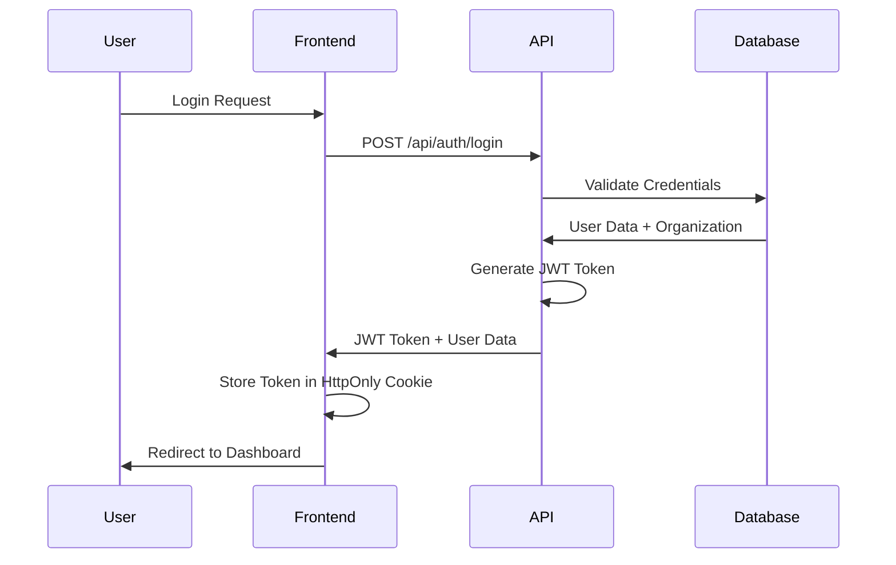
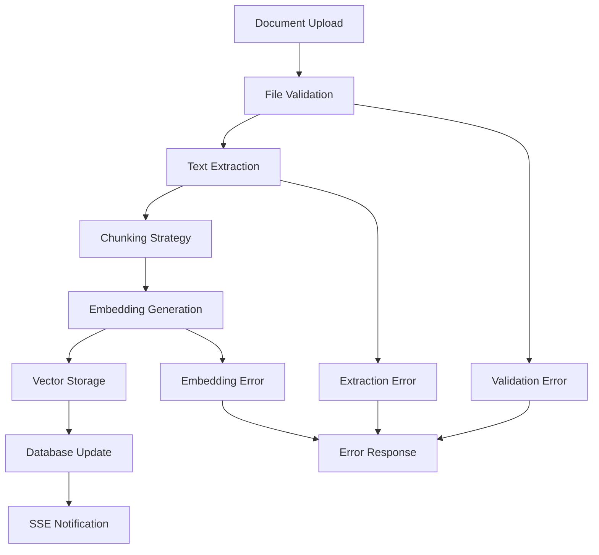

# 🏗️ Avenai Architecture Guide

## 📋 Overview

This document provides a comprehensive overview of Avenai's architecture, design decisions, and technical implementation details for developers joining the team.

---

## 🎯 System Architecture

### High-Level Architecture

```
┌─────────────────────────────────────────────────────────────────┐
│                        CLIENT LAYER                            │
├─────────────────────────────────────────────────────────────────┤
│  Web App (Next.js)  │  Mobile App (Future)  │  API Clients    │
└─────────────────────┼───────────────────────┼─────────────────┘
                      │                       │
┌─────────────────────▼───────────────────────▼─────────────────┐
│                    API GATEWAY LAYER                          │
├─────────────────────────────────────────────────────────────────┤
│  Authentication  │  Rate Limiting  │  Request Validation       │
│  CORS Handling   │  Error Handling │  Response Caching        │
└─────────────────────┼─────────────────────────────────────────┘
                      │
┌─────────────────────▼─────────────────────────────────────────┐
│                    BUSINESS LOGIC LAYER                       │
├─────────────────────────────────────────────────────────────────┤
│  Document Processing │  Chat Engine    │  Analytics Engine    │
│  User Management     │  Admin Panel    │  Billing System      │
└─────────────────────┼─────────────────────────────────────────┘
                      │
┌─────────────────────▼─────────────────────────────────────────┐
│                    DATA LAYER                                 │
├─────────────────────────────────────────────────────────────────┤
│  PostgreSQL (Neon)  │  Pinecone (Vector) │  File Storage      │
│  Redis Cache        │  CDN (Future)      │  Backup Systems    │
└─────────────────────┼─────────────────────────────────────────┘
                      │
┌─────────────────────▼─────────────────────────────────────────┐
│                    EXTERNAL SERVICES                          │
├─────────────────────────────────────────────────────────────────┤
│  OpenAI API        │  Stripe Payments  │  Resend Email       │
│  Vercel Platform   │  Monitoring       │  Analytics         │
└─────────────────────────────────────────────────────────────────┘
```

---

## 🏢 Multi-Tenant Architecture

### Tenant Isolation Strategy

Avenai uses **organization-based multi-tenancy** with multiple layers of isolation:

#### 1. Database Level
```sql
-- All tables include organization_id for data isolation
CREATE TABLE documents (
  id UUID PRIMARY KEY,
  organization_id UUID NOT NULL,
  title VARCHAR(255) NOT NULL,
  -- ... other fields
);

-- Indexes for efficient organization-scoped queries
CREATE INDEX idx_documents_org ON documents(organization_id);
CREATE INDEX idx_documents_org_status ON documents(organization_id, status);
```

#### 2. Application Level
```typescript
// All database queries automatically scoped to organization
const documents = await prisma.document.findMany({
  where: {
    organizationId: session.user.organizationId, // Always required
    // ... other filters
  }
});

// Middleware enforces organization boundaries
export const withAuth = (handler: Function) => {
  return async (req: NextRequest) => {
    const session = await getSession();
    if (!session?.user?.organizationId) {
      return NextResponse.json({ error: 'Unauthorized' }, { status: 401 });
    }
    return handler(req, session);
  };
};
```

#### 3. API Level
```typescript
// All API routes check organization access
async function handleGetDocuments(req: NextRequest, session: any) {
  const organizationId = session.user.organizationId;
  
  // Query automatically scoped to organization
  const documents = await prisma.document.findMany({
    where: { organizationId }
  });
  
  return NextResponse.json({ documents });
}
```

### Data Flow Architecture

```
User Request → Authentication → Organization Validation → Data Access
     ↓              ↓                    ↓                    ↓
Frontend → API Gateway → Business Logic → Database Query
     ↑              ↑                    ↑                    ↑
Response ← Caching Layer ← Processing ← Data Retrieval
```

---

## 🔐 Security Architecture

### Authentication Flow



### Authorization Levels

```typescript
enum UserRole {
  SUPER_ADMIN = 'SUPER_ADMIN',  // Platform-wide access
  OWNER = 'OWNER',              // Organization owner
  ADMIN = 'ADMIN',              // Organization admin
  MEMBER = 'MEMBER',            // Regular user
  VIEWER = 'VIEWER'             // Read-only access
}

// Role-based access control
const rolePermissions = {
  SUPER_ADMIN: ['*'], // All permissions
  OWNER: ['manage_org', 'manage_users', 'manage_documents', 'view_analytics'],
  ADMIN: ['manage_users', 'manage_documents', 'view_analytics'],
  MEMBER: ['manage_documents', 'view_own_data'],
  VIEWER: ['view_documents']
};
```

### Security Layers

1. **Network Security**
   - HTTPS everywhere
   - CORS configuration
   - Rate limiting per IP

2. **Application Security**
   - JWT token validation
   - Input sanitization
   - SQL injection prevention (Prisma)

3. **Data Security**
   - Password hashing (bcrypt)
   - API key encryption
   - Sensitive data masking

---

## 📊 Performance Architecture

### Caching Strategy

```typescript
// Multi-layer caching architecture
const cacheLayers = {
  // L1: In-memory cache (fastest)
  memory: new LRUCache({
    maxSize: 1000,
    maxAge: 5 * 60 * 1000 // 5 minutes
  }),
  
  // L2: API response cache
  api: new LRUCache({
    maxSize: 500,
    maxAge: 2 * 60 * 1000 // 2 minutes
  }),
  
  // L3: Database query cache
  database: new LRUCache({
    maxSize: 2000,
    maxAge: 10 * 60 * 1000 // 10 minutes
  })
};
```

### Query Optimization

```typescript
// Before: Sequential queries (slow)
const user = await prisma.user.findFirst({ where: { email } });
const org = await prisma.organization.findUnique({ where: { id: user.organizationId } });
const documents = await prisma.document.findMany({ where: { organizationId: org.id } });

// After: Parallel queries (fast)
const [user, org, documents] = await Promise.all([
  prisma.user.findFirst({ where: { email } }),
  prisma.organization.findUnique({ where: { id: user.organizationId } }),
  prisma.document.findMany({ where: { organizationId: org.id } })
]);
```

### Database Indexing Strategy

```sql
-- Composite indexes for common query patterns
CREATE INDEX CONCURRENTLY idx_documents_org_status_created 
ON documents(organization_id, status, created_at DESC);

CREATE INDEX CONCURRENTLY idx_document_chunks_org_created 
ON document_chunks(organization_id, created_at DESC);

CREATE INDEX CONCURRENTLY idx_chat_sessions_org_activity 
ON chat_sessions(organization_id, last_activity_at DESC);

-- Partial indexes for active records
CREATE INDEX CONCURRENTLY idx_users_active 
ON users(organization_id, email) WHERE is_active = true;
```

---

## 🔄 Data Processing Architecture

### Document Processing Pipeline



### Chat Processing Flow

```typescript
// Chat request processing architecture
async function processChatRequest(message: string, organizationId: string) {
  // 1. Semantic search in vector database
  const vectorResults = await searchSimilarDocuments(message, organizationId);
  
  // 2. Database fallback for additional context
  const dbResults = await prisma.documentChunk.findMany({
    where: { 
      organizationId,
      content: { contains: message, mode: 'insensitive' }
    }
  });
  
  // 3. Context assembly and ranking
  const context = assembleContext(vectorResults, dbResults);
  
  // 4. OpenAI API call with context
  const response = await openai.chat.completions.create({
    model: 'gpt-4',
    messages: [
      { role: 'system', content: 'You are a helpful AI assistant...' },
      { role: 'user', content: `${context}\n\nUser: ${message}` }
    ]
  });
  
  return response.choices[0].message.content;
}
```

---

## 🎨 Frontend Architecture

### Component Hierarchy

```
App
├── Layout
│   ├── Navigation
│   ├── Sidebar
│   └── Main Content
├── Pages
│   ├── Dashboard
│   ├── Documents
│   ├── Chat
│   └── Admin
└── Components
    ├── UI (Base components)
    ├── Forms
    ├── Charts
    └── Widgets
```

### State Management

```typescript
// Context-based state management
const AppContext = createContext({
  user: null,
  organization: null,
  loading: false,
  error: null
});

// Custom hooks for data fetching
export const useDocuments = () => {
  const [documents, setDocuments] = useState([]);
  const [loading, setLoading] = useState(true);
  
  useEffect(() => {
    fetchDocuments().then(setDocuments).finally(() => setLoading(false));
  }, []);
  
  return { documents, loading, refetch: () => fetchDocuments() };
};
```

### Performance Optimizations

```typescript
// Memoized components to prevent unnecessary re-renders
export const DocumentList = memo(function DocumentList({ documents }) {
  const handleDelete = useCallback((id: string) => {
    // Optimized delete handler
  }, []);
  
  return (
    <VirtualizedList
      items={documents}
      renderItem={(doc) => (
        <DocumentItem 
          key={doc.id} 
          document={doc} 
          onDelete={handleDelete} 
        />
      )}
    />
  );
});

// Debounced search to reduce API calls
const SearchInput = memo(function SearchInput({ onSearch }) {
  const [value, setValue] = useState('');
  const debouncedValue = useDebounce(value, 300);
  
  useEffect(() => {
    onSearch(debouncedValue);
  }, [debouncedValue, onSearch]);
  
  return <input value={value} onChange={(e) => setValue(e.target.value)} />;
});
```

---

## 🔌 API Architecture

### RESTful API Design

```typescript
// Consistent API response format
interface ApiResponse<T> {
  success: boolean;
  data?: T;
  error?: {
    code: string;
    message: string;
    statusCode: number;
  };
  message?: string;
  timestamp: string;
}

// Standard HTTP status codes
const statusCodes = {
  OK: 200,
  CREATED: 201,
  BAD_REQUEST: 400,
  UNAUTHORIZED: 401,
  FORBIDDEN: 403,
  NOT_FOUND: 404,
  INTERNAL_ERROR: 500
};
```

### Middleware Stack

```typescript
// API middleware composition
export const createOptimizedHandler = (handler: Function, options: any) => {
  let optimizedHandler = handler;
  
  // Apply middleware in order
  if (options.cache) optimizedHandler = withCache(optimizedHandler, options.cache);
  if (options.rateLimit) optimizedHandler = withRateLimit(optimizedHandler, options.rateLimit);
  if (options.validation) optimizedHandler = withValidation(optimizedHandler, options.validation);
  if (options.auth) optimizedHandler = withAuth(optimizedHandler);
  if (options.errorHandling) optimizedHandler = withErrorHandling(optimizedHandler);
  
  return optimizedHandler;
};
```

### Error Handling Strategy

```typescript
// Centralized error handling
export const createErrorResponse = (error: {
  code: string;
  message: string;
  statusCode: number;
}) => {
  return NextResponse.json({
    success: false,
    error: {
      code: error.code,
      message: error.message,
      statusCode: error.statusCode
    },
    timestamp: new Date().toISOString()
  }, { status: error.statusCode });
};

// Usage in API routes
try {
  // API logic
} catch (error) {
  console.error('API Error:', error);
  return createErrorResponse({
    code: 'INTERNAL_ERROR',
    message: 'An unexpected error occurred',
    statusCode: 500
  });
}
```

---

## 🗄️ Database Architecture

### Schema Design Principles

1. **Normalization**: Proper 3NF design to avoid redundancy
2. **Indexing**: Strategic indexes for query performance
3. **Constraints**: Foreign keys and check constraints for data integrity
4. **Soft Deletes**: `isActive` flags instead of hard deletes
5. **Audit Trail**: `createdAt`, `updatedAt` timestamps

### Relationship Design

```typescript
// One-to-Many relationships
Organization → Users (1:many)
Organization → Documents (1:many)
Document → DocumentChunks (1:many)
Organization → ChatSessions (1:many)

// Many-to-Many relationships
Documents ↔ Users (via DocumentShare)
```

### Migration Strategy

```typescript
// Safe migration practices
export async function migrateDatabase() {
  // 1. Create new columns with defaults
  await prisma.$executeRaw`
    ALTER TABLE users ADD COLUMN email_verified BOOLEAN DEFAULT false;
  `;
  
  // 2. Populate new columns
  await prisma.$executeRaw`
    UPDATE users SET email_verified = true WHERE email_verified_at IS NOT NULL;
  `;
  
  // 3. Add constraints
  await prisma.$executeRaw`
    ALTER TABLE users ADD CONSTRAINT users_email_verified_check 
    CHECK (email_verified = true OR email_verified_at IS NULL);
  `;
}
```

---

## 🚀 Deployment Architecture

### Vercel Deployment Strategy

```yaml
# vercel.json configuration
{
  "buildCommand": "npm run build",
  "outputDirectory": ".next",
  "framework": "nextjs",
  "functions": {
    "app/api/**/*.ts": {
      "maxDuration": 30
    }
  },
  "env": {
    "NODE_ENV": "production"
  }
}
```

### Environment Management

```typescript
// Environment-specific configurations
const config = {
  development: {
    database: process.env.DATABASE_URL_DEV,
    redis: process.env.REDIS_URL_DEV,
    logLevel: 'debug'
  },
  production: {
    database: process.env.DATABASE_URL,
    redis: process.env.REDIS_URL,
    logLevel: 'error'
  }
};
```

### Monitoring and Observability

```typescript
// Performance monitoring
export const withPerformanceMonitoring = (handler: Function, endpointName: string) => {
  return async (req: NextRequest) => {
    const startTime = Date.now();
    
    try {
      const response = await handler(req);
      const duration = Date.now() - startTime;
      
      // Log slow requests
      if (duration > 1000) {
        console.warn(`Slow API request: ${endpointName} took ${duration}ms`);
      }
      
      // Add performance headers
      response.headers.set('X-Response-Time', `${duration}ms`);
      
      return response;
    } catch (error) {
      const duration = Date.now() - startTime;
      console.error(`API Error in ${endpointName} after ${duration}ms:`, error);
      throw error;
    }
  };
};
```

---

## 🔄 Scalability Considerations

### Horizontal Scaling

1. **Stateless API**: All API routes are stateless
2. **Database Connection Pooling**: Prisma connection pooling
3. **CDN Integration**: Static assets served via CDN
4. **Load Balancing**: Vercel handles load balancing

### Vertical Scaling

1. **Query Optimization**: Parallel queries and caching
2. **Memory Management**: LRU caches with size limits
3. **Code Splitting**: Dynamic imports for large components
4. **Bundle Optimization**: Tree shaking and minification

### Future Scaling Plans

1. **Microservices**: Split into document processing, chat, and analytics services
2. **Event-Driven Architecture**: Message queues for async processing
3. **Caching Layer**: Redis for distributed caching
4. **Database Sharding**: Partition by organization for large scale

---

## 📈 Performance Metrics

### Current Performance Targets

| Metric | Target | Current | Status |
|--------|--------|---------|--------|
| API Response Time | <500ms | 200-500ms | ✅ |
| Page Load Time | <3s | 2-4s | ✅ |
| Database Query Time | <200ms | 50-200ms | ✅ |
| Cache Hit Rate | >70% | 70-80% | ✅ |
| Error Rate | <1% | <0.5% | ✅ |

### Monitoring Strategy

1. **Real-time Monitoring**: Vercel Analytics
2. **Error Tracking**: Console logging with context
3. **Performance Tracking**: Response time headers
4. **Database Monitoring**: Query performance analysis

---

## 🛠️ Development Workflow

### Code Organization

```typescript
// Feature-based organization
features/
├── auth/
│   ├── components/
│   ├── hooks/
│   ├── services/
│   └── types/
├── documents/
│   ├── components/
│   ├── hooks/
│   ├── services/
│   └── types/
└── chat/
    ├── components/
    ├── hooks/
    ├── services/
    └── types/
```

### Testing Strategy

```typescript
// Unit tests for utilities
describe('database-optimizations', () => {
  it('should cache query results', async () => {
    const result1 = await cachedQuery(() => expensiveQuery(), { key: 'test' });
    const result2 = await cachedQuery(() => expensiveQuery(), { key: 'test' });
    
    expect(result1).toEqual(result2);
    expect(expensiveQuery).toHaveBeenCalledTimes(1);
  });
});

// Integration tests for API routes
describe('/api/documents', () => {
  it('should return documents for authenticated user', async () => {
    const response = await request(app)
      .get('/api/documents')
      .set('Authorization', `Bearer ${validToken}`)
      .expect(200);
    
    expect(response.body.success).toBe(true);
    expect(response.body.data.items).toBeDefined();
  });
});
```

---

## 🎯 Future Architecture Evolution

### Planned Improvements

1. **GraphQL API**: More efficient data fetching
2. **Real-time Features**: WebSocket integration
3. **Microservices**: Service-oriented architecture
4. **Event Sourcing**: Audit trail and data consistency
5. **CQRS**: Command Query Responsibility Segregation

### Technology Roadmap

- **Q1 2024**: Enhanced caching and performance optimizations
- **Q2 2024**: Real-time collaboration features
- **Q3 2024**: Mobile application development
- **Q4 2024**: Enterprise features and SSO integration

---

*This architecture guide is living documentation that evolves with the codebase. Last updated: September 2024*
